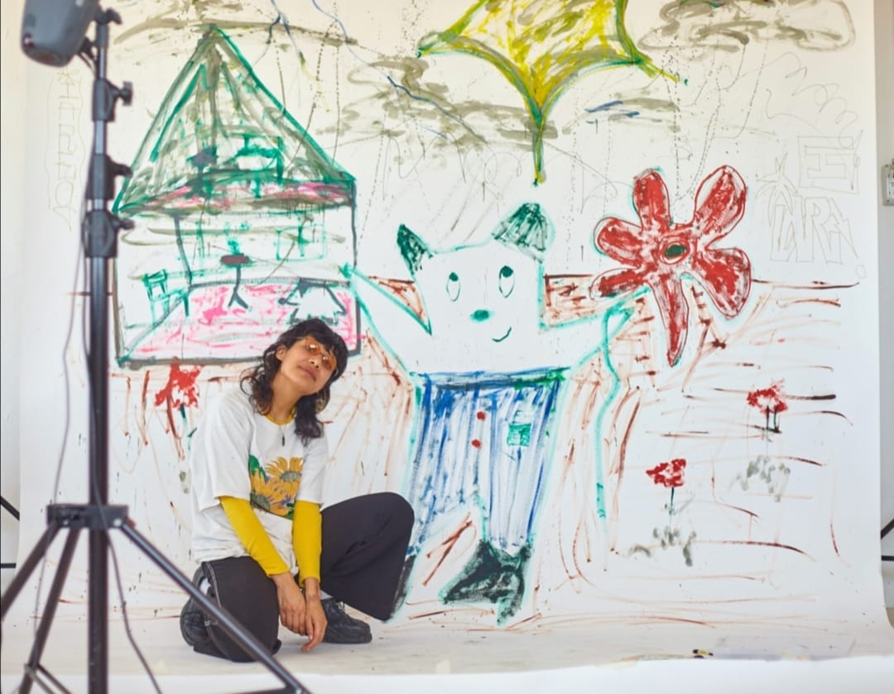
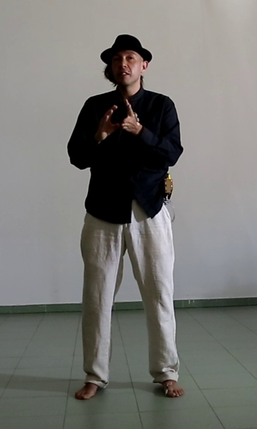

# Computacion-Física-Arte-Interactivo

En este repositorio se encontrarán los materiales del taller: INTRODUCCIÓN A LA COMPUTACIÓN FÍSICA Y EL ARTE INTERACTIVO CON BARE CONDUCTIVE + RASPBERRY + TOUCHDESIGNER

## La tecnología como nuevo soporte artistico

## Slides

Aquí encontraras la [presentación del workshop](https://docs.google.com/presentation/d/1Ly4eoGEeqiBYMibP8VgbU4bCvPUX1-qZQs6pPOvgtGo/edit?usp=sharing)

## Materiales del concurso

<https://github.com/JoakuDeSotavento/AI-to-people>

## Libros

Esta es una selección de los mejores libros para estos menesteres

-------- drive.google.com/file/d/1EdUHApmi8gDPhFTLEqCSNj-p55fkkJvF/view?usp=sharing -------------

## Ejemplos

<https://openprocessing.org/user/278519?view=activity>

## Autore

**Ana Rodríguez**
aka **Polvo Eres**

Ana Rodríguez es Licenciada en Artes Visuales por parte de la Universidad Michoacana de San Nicolas de Hidalgo (Morelia, México, 2018).Este año concluyo el Máter de Investigación en Prácticas Artísticas y Visuales por parte de la Universidad de castilla la Mancha.
En 2019 curso el Programa Orientado a Prácticas Subalternas en Matadero, Madrid. Su trabajo está enfocado en temas como el poscolonialismo, el ecofeminismo y la tecnología.

[instagram](https://www.instagram.com/polvo_eres)

**Joaquín R. Díaz Duran**
aka **Joaku de Sotavento**

Joaquín Díaz Durán (1982, Ciudad de México) actualmente cursa el programa de Doctorado en Investigación en Humanidades Artes y Educación de la UCLM (España). Desarrolla su investigación Inside The Stomach of a Robot en vinculación a Medialab-Prado.
El año pasado presentó su trabajo con la Interfaz Cyborg en los festivales Scratxe#13 en Vitoria-Gasteiz, Ctrl Art Supr en el Hostal Bastardo en Madrid y en colaboración con el cineasta Francisco Bouzas presentan la performance Un Juego Latente en Tabakalera-Donostia. Ha impartido talleres de arte interactivo, diseño de interfaces y robótica en la Fundación Telefónica de Madrid (Marzo 2019), en MediaLab Prado (Abril y Diciembre 2019) y en el Festival Future Places, Portugal (Octubre 2017). Del 2012 al 2015 formó parte del equipo de robótica del laboratorio de Birobotics de la UNAM encargado del diseño y construcción de la apariencia del robot Justina, participando en los concurso Robocup (México 2012, Holanda 2013, Brasil 2014 y China 2015) y RockIn (Portugal 2015).

[twitter](https://twitter.com/joaku_Sotavento) |
[web](https://www.arterobotico.com) |
[github](https://github.com/JoakuDeSotavento) |
